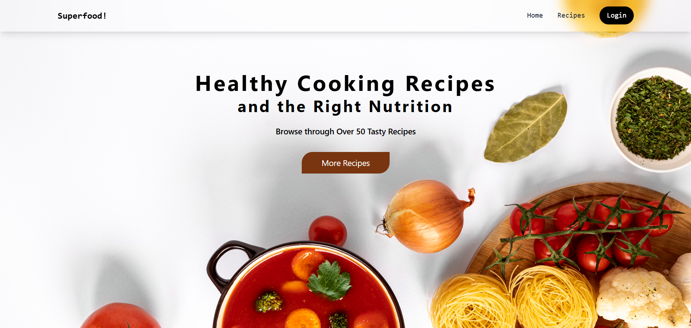
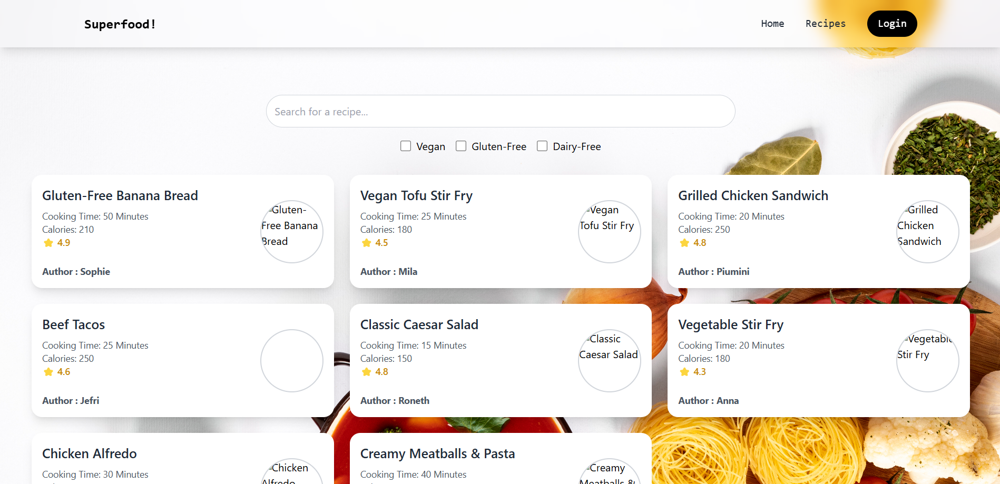

# 🍽️ Flavor Exchange - Recipe Sharing Platform

Flavor Exchange is a user-friendly recipe sharing platform built with **React**, **TypeScript**, **Redux**, **TailwindCss** and **Material-UI**, enabling users to browse, share, update, and manage their favorite recipes. Perfect for home cooks and food enthusiasts!


## 🚀 Features

- 🧭 **Routing** – Navigate easily with React Router.
- 📦 **State Management** – Powered by Redux Toolkit.
- 🧪 **Mock Backend** – Uses [MockAPI.io](https://mockapi.io/) to simulate real API interactions.
- 📝 **CRUD Functionality** – Create, read, update (with modal), and delete recipes.
- 💾 **LocalStorage Support** – Favorite recipes persist across sessions.
- 🌟 **User-Friendly UI** – Built with Material-UI for a sleek, responsive design.
- 🔍 **Search & Filter** – Easily find your next recipe to try!

## 🛠️ Tech Stack

- **Frontend**: React, TypeScript, Redux Toolkit, React Router,TailwindCss, Material-UI, Axios
- **Backend**: MockAPI.io (Mocked REST API)

## 📸 Screenshots

 


## 🧑‍🍳 Getting Started

1. **Clone the repository**
   ```bash
   [git clone https://github.com/yourusername/flavor-exchange.git
   cd flavor-exchange](https://github.com/SithiraRoneth/Recipe-Sharing-Platform.git)
